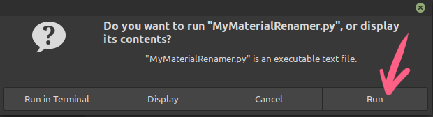

# MyMaterial Rename Tool

**MyMaterial Rename Tool** is a custom rename tool built with Python and [PyQt5](https://www.riverbankcomputing.com/static/Docs/PyQt5/index.html). It features tags for the filename, for example.

## Running the Application

To run **MyMaterialRenamer**, you need to download the source code. Then open a terminal or command-line window and run the following steps:

1. Create and activate a Python virtual environment.

```sh
$ cd MyMaterial_Rename_Tool_source_code/
$ python3 -m venv ./venv
$ source venv/bin/activate
(venv) $
```

2. Install the dependencies.

```sh
(venv) $ pip install -r PyQt5==5.15.2
```

3. Run the application.

```sh
(venv) $ python3 MyMaterialRenamer.py
```

**Note:** This application was coded and tested with Python 3.8.10 and PyQt 5.15.2.

In Linux, you should be also able to double-click the file and select 'Run' once Python3 and PyQt are installed:



## Release History

- 1.7
  - Basic functionality is there

## About the Authors

- Leodanis Pozo Ramos – [@lpozo78](https://twitter.com/lpozo78) – leodanis@realpython.com -
https://realpython.com/bulk-file-rename-tool-python/
- Esa Kylli - [@esakylli](https://twitter.com/esakylli) - esa.kylli@gmail.com
- eyllanesc - https://stackoverflow.com/a/68401672/4383420
- patate1684 - https://stackoverflow.com/a/68410759/4383420
- Manu Järvinen – [@manujarvinen](https://twitter.com/manujarvinen) – manu@gearnoodle.com
